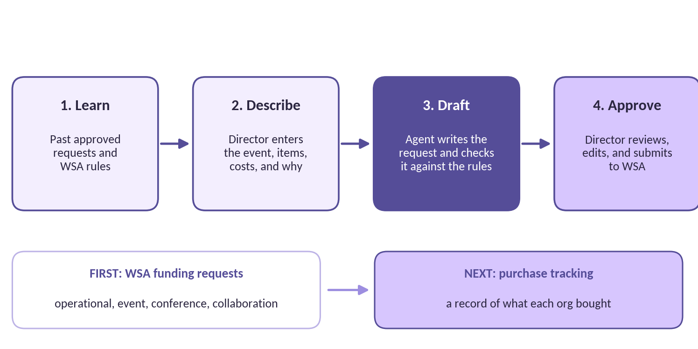

# DSAIC Finance Agent

An AI agent that drafts Western Student Association (WSA) funding requests for student organizations at Western Michigan University, so finance directors spend their time reviewing documents instead of building them from scratch.

Built by the [Data Science & AI Club (DSAIC)](https://www.linkedin.com/company/data-science-club-wmu) at WMU.

> **Status:** Phase 1, Data Foundation. Sprint 1 runs October 2 to October 15, 2026. Follow progress on the [project board](https://github.com/users/rafiaauthoi/projects/1).

## The problem

Student organizations at WMU request funding from WSA, the student government. Every request has to follow WSA's rules, and operational, event, conference, and collaboration budgets each come with their own criteria. Since September 2026, every request also needs proof the club has sought outside funding.

For a finance director, that means hours of administrative data entry, repeated for every event the organization wants funded. And when officers graduate, their knowledge of what gets approved leaves with them.

## What the agent does



1. **Learns from what's worked before.** It studies previously approved funding requests and WSA's criteria for each budget type.
2. **Takes in what the org needs.** The event or purpose, the items, the costs, and why they're needed.
3. **Drafts the request.** It fills out WSA's official template following the rules for the right budget type.
4. **Flags problems early.** Anything that breaks a WSA rule, or matches a common reason proposals get rejected, is highlighted before submission.
5. **A human makes the final call.** The finance director reviews, edits, and submits. The agent never submits anything on its own.

## What's done so far

- **WSA rules reference.** 160+ funding rules, each with a stable ID and a cited source, checked against the WSAAC bylaws passed September 9, 2026. A structured YAML version feeds the rules checker. ([docs/wsa-guidelines](docs/wsa-guidelines/README.md))
- **Allocations quiz study guide.** Every club's representative must score 80% on WSAAC's quiz each school year before submitting. The guide maps each quiz topic to the rules behind it. ([guide](docs/wsa-guidelines/allocations-quiz-guide.md))
- **Data privacy process.** An anonymization checklist with a required second-person check before any sample enters this public repository. ([checklist](docs/anonymization-checklist.md))
- **Project documentation.** A brief, a from-zero refresher guide for new members, and a full charter with roles, a RACI matrix, risks, and milestones.
- **Team onboarding.** Seven members with defined roles, issue templates, a protected main branch, and a getting-started guide written for non-programmers.

## Roadmap

- [ ] **Phase 1: Data foundation** (in progress). Collect and anonymize past approved requests; document WSA rules for each budget type
- [ ] **Phase 2: Tasks and design.** Decide exactly what to automate and choose the tech stack, with evidence
- [ ] **Phase 3: First drafts.** Generate event budget requests that pass the rules checker
- [ ] **Phase 4: Full coverage.** Operational, conference, and collaboration budgets, plus a pilot with finance directors
- [ ] **Phase 5: Deploy and track.** Per-organization setup on DSAIC's AI inference server, then purchase tracking

## How it's built

- **Python** for the agent, the rules checker, and data processing
- **YAML** for WSA's rules, so the checker enforces them in code, not just through the AI
- **Per-organization settings** in `orgs/`, so each club's data stays separate and its experience fits how it works
- **Agent framework:** to be chosen in Phase 2 after testing options against real tasks

## How we work

- **Agile hybrid:** six phases with milestone gates, two-week sprints inside each phase, and a Kanban board for daily work
- **Every change goes through a pull request.** `main` is protected; nothing merges without a review, including from the project lead
- **Definition of Done:** reviewed, merged, no real data or secrets, documentation updated, card closed

Details are in the [Project Charter](docs/project/03-project-charter.md), section 7.1.

## Security and privacy

This repository is public, so real financial data never enters it.

- **Branch rules** block direct pushes to `main` and require an approved review
- **CODEOWNERS** requires the project lead's approval on every change
- **`.gitignore`** blocks spreadsheets, PDFs, and documents everywhere except anonymized samples and rule references
- **Anonymization checklist** with a two-person check before any sample is committed
- **Least-privilege access:** real funding documents live in a restricted shared drive, separate from team-wide files
- **WSA's bylaws and slides are cited by section,** never copied in

## Add-ons

- **[Branded finance tracker](tools/branded-tracker/README.md).** Builds an Excel tracker in a club's own colors and logo: approved vs. spent by source, expiring funds, an auto-filled WSAAC budget tracker, and an inventory checklist.

## Project documents

| Document | What it covers |
|---|---|
| [Project Brief](docs/project/01-project-brief.md) | Why we're building it, who it's for, and what it is |
| [Refresher Guide](docs/project/02-refresher-guide.md) | WSA funding, Git and GitHub, and how the team works, explained from zero |
| [Project Charter](docs/project/03-project-charter.md) | Roles, expectations, deliverables, phases, and risks |
| [WSA Guidelines](docs/wsa-guidelines/README.md) | WSA's funding rules, checked against the current bylaws |

## Repository structure

```
data/
  raw/              real documents (never committed)
  processed/        cleaned real data (never committed)
  sample/           anonymized example data
docs/
  project/          project brief, refresher guide, charter
  wsa-guidelines/   WSA funding rules and the quiz study guide
orgs/               per-organization settings and branding
src/finance_agent/  agent code
tests/
tools/              add-ons, such as the branded tracker
```

## Getting started

New to the project? Start with the [Project Brief](docs/project/01-project-brief.md), then [docs/getting-started.md](docs/getting-started.md) and [CONTRIBUTING.md](CONTRIBUTING.md).

## Team

| Name | Role | GitHub |
|---|---|---|
| Rafia Authoi | Project Lead | [@rafiaauthoi](https://github.com/rafiaauthoi) |
| Saad Mahmud | Systems & Security Lead | [@wolv1ee](https://github.com/wolv1ee) |
| Justin Tan | Agent Developer | [@BL4NK3D06](https://github.com/BL4NK3D06) |
| Matt Phinney | Rules & QA Analyst | [@mattphinney-94](https://github.com/mattphinney-94) |
| Syed Sobhan | Finance Product Owner | [@syedahinwmu](https://github.com/syedahinwmu) |
| Drew Lindeboom | Financial Data Analyst | [@Drew-lindeboom](https://github.com/Drew-lindeboom) |
| Sami Sarker | Reporting & Insights Analyst | [@samisarker04](https://github.com/samisarker04) |

What each person is working on right now is in [docs/team.md](docs/team.md). Built with members of the Data Science & AI Club at Western Michigan University.

## License

[MIT](LICENSE)
