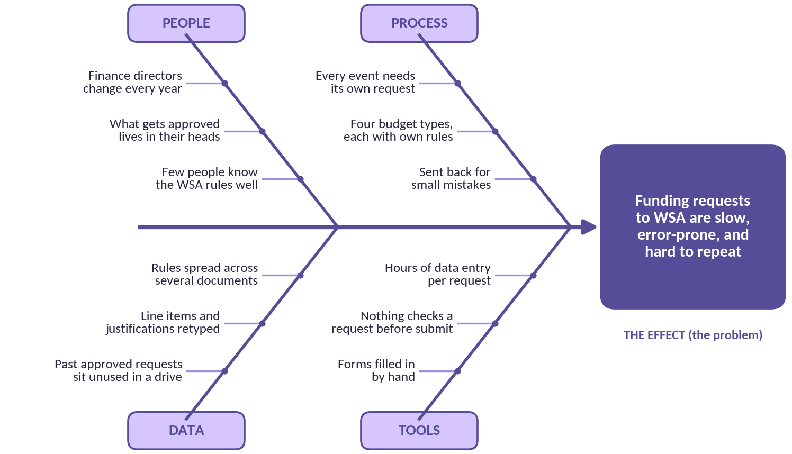
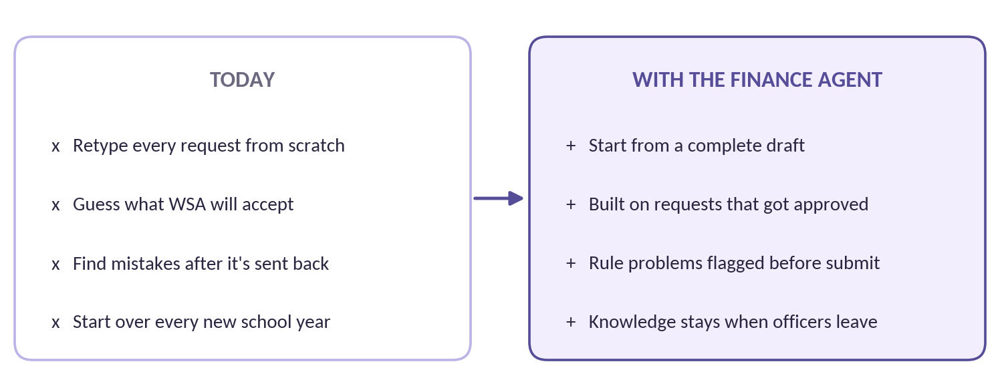
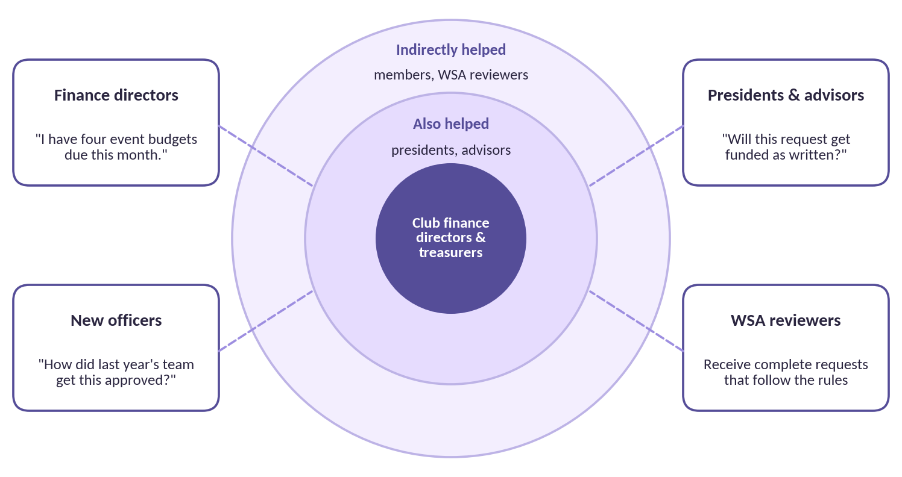

# DSAIC Finance Agent: Project Brief

**Document 1 of 3.** Why we're building it, who it's for, and what it is.

| | |
|---|---|
| **Read this if**   | You're thinking about joining the project team. No technical background needed.                  |
| **Project lead**   | Rafia Authoi                                                                                     |
| **Sponsor**        | Data Science & AI Club (DSAIC) E-Board                                                           |
| **Repository**     | [github.com/rafiaauthoi/dsaic-finance-agent](https://github.com/rafiaauthoi/dsaic-finance-agent) |
| **Version**        | 2.1 \| Draft                                                                                     |
| **Next documents** | Document 2: Refresher Guide \| Document 3: Project Charter                                       |

## The Short Version

Every student organization at WMU that wants funding has to submit a budget request to the Western Student Association (WSA), our student government. Each request has to follow WSA's rules, and operational, event, conference, and collaboration budgets each have their own criteria. Since September 2026, every request also has to include proof the club has looked for other funding, like dues, fundraising, or sponsorships. Today, finance directors build these requests by hand, one event at a time.

We're building an AI agent that does the heavy lifting. It learns from requests WSA has already approved, drafts new ones in the right format, and flags anything that might break a rule. The finance director stays in charge: they review, edit, and submit. The agent never submits anything on its own.

> **Our rule for this project**
>
> Why build something if it isn't solving an actual problem? Every feature has to trace back to a real finance director with a real request to get approved. If we can't name who it helps, we don't build it.

### The 3 Ws at a glance

|          | **In one sentence**                                                                                                                                                |
|----------|--------------------------------------------------------------------------------------------------------------------------------------------------------------------|
| **WHY**  | Building WSA funding requests is slow, administrative data entry, repeated for every event, and the knowledge of what gets approved leaves when officers graduate. |
| **WHO**  | Club finance directors and treasurers first, then presidents, advisors, future officers, and the WSA reviewers who receive the requests.                           |
| **WHAT** | An AI agent that drafts WSA funding requests from past approved examples and checks them against WSA's rules, with a human approving every submission.             |

**PART 1**

## WHY: The Problem We're Solving

Most clubs need WSA funding to operate: monitors, equipment, snacks for meetings, event costs, conference travel. Getting that funding means writing a budget request that lists every item, its cost, and why the club needs it, and it has to follow WSA's rules for that type of budget.

For a finance director with several events coming up, that means filling out the same kind of form again and again, checking it against rules spread across several documents, and hoping nothing gets sent back. To make sure we're solving the right problem, we used an Ishikawa (fishbone) diagram, a standard project management tool for finding root causes. The problem sits at the head of the fish, and each bone is a category of causes.

*Figure 1. Root-cause (fishbone) analysis of why WSA funding requests are hard*

#### What the diagram tells us

The problem isn't that finance directors are doing a bad job. The process works against them. Every request is built from scratch even though the club has a drive full of requests WSA already approved. Nothing checks a draft against the rules before it's submitted, so mistakes surface only when a request gets sent back. And every year a new finance director starts over, because what worked last year lived in someone else's head.

### What this looks like in real life

> **A familiar scenario**
>
> A finance director has three events and a conference coming up this semester. Each one needs its own WSA request, and the conference request follows different rules than the events.
>
> They open last year's requests (if they can find them), copy the parts that seem right, retype every item and justification, and double-check the rules documents. One request comes back for a missing detail. Multiply that by every club on campus.

*Figure 2. The same work, before and after the Finance Agent*

**PART 2**

## WHO: Who This Is For

A tool is only useful if we know exactly who uses it and what they need. Figure 3 starts with the people closest to the problem in the center and moves outward.

*Figure 3. Who the Finance Agent serves (stakeholder map)*

| **Who**                            | **Their problem today**                                   | **How the agent helps**                                                |
|------------------------------------|-----------------------------------------------------------|------------------------------------------------------------------------|
| **Finance directors & treasurers** | Hours of data entry per request, repeated for every event | Start from a complete, rule-checked draft and just review it           |
| **New officers**                   | Inherit a drive of old requests with no explanation       | Every approved request becomes a working example the agent learns from |
| **Presidents & advisors**          | Can't tell if a request will be funded as written         | See drafts that already follow WSA's criteria                          |
| **WSA reviewers**                  | Receive incomplete requests that need to be sent back     | Receive complete requests that follow the rules the first time         |
| **Our project team (you)**         | Want real, hands-on experience with AI                    | Build an agent real clubs use, with a strong story for your resume     |

**PART 3**

## WHAT: What We're Building

The Finance Agent works in four steps. It learns from what WSA has approved before, takes in what the club needs, drafts the request and checks it against the rules, and hands it to a person for the final call.

*Figure 4. How the Finance Agent works*

#### Why a human always approves

This is real money and a real relationship with student government. The agent's job is to remove the busywork, not the judgment. Finance directors review every draft, fix anything that's off, and submit it themselves. This is called human-in-the-loop design, and it's how responsible AI tools handle anything with real consequences.

#### Why past approved requests matter so much

The best evidence of what WSA accepts is what WSA has already accepted. Our club and partner organizations have approved requests going back years, sitting unused in a shared drive. Collecting and organizing them is the first big phase of the project, and it's work that needs zero coding experience.

#### What comes after funding requests

WSA requests are the first procedure we're automating. Next is purchase tracking: keeping a record of what each organization bought with approved funds. Over time, each organization using the agent gets its own setup fitted to how it works.

### What it is, and what it isn't

| **The Finance Agent IS**                                      | **The Finance Agent IS NOT**                               |
|---------------------------------------------------------------|------------------------------------------------------------|
| A drafting assistant for WSA funding requests                 | Something that submits requests or spends money on its own |
| Built from requests WSA has actually approved                 | A guarantee that WSA will approve a request                |
| A checker that flags possible rule problems before submission | A replacement for a finance director's judgment            |
| Set up separately for each organization that uses it          | A place where one club's finances are visible to another   |

### A few words you'll hear a lot

| **Term**                  | **What it means in plain language**                                                                               |
|---------------------------|-------------------------------------------------------------------------------------------------------------------|
| **WSA**                   | Western Student Association, WMU's student government. It reviews and approves funding for student organizations. |
| **Budget type**           | WSA sorts requests into operational, event, conference, and collaboration budgets. Each has its own rules.        |
| **AI agent**              | An AI that can do more than chat. It can follow steps, use tools, and produce real documents.                     |
| **Human-in-the-loop**     | A person reviews and approves the AI's work before anything happens in the real world.                            |
| **Version control (Git)** | A system that saves every change to a project so a team can work together safely. Covered in Document 2.          |

**PART 4**

## Is This Project a Good Fit for You?

> **No coding experience required**
>
> Our first phase is collecting past requests, mapping WSA's form, and writing up the rules in plain language. If you can use a spreadsheet, read carefully, and show up consistently, there's a meaningful role for you. We'll teach the technical parts.

### What you'll get out of it

- **A real portfolio project.** A public GitHub repository solving a problem every club on campus has.

- **Hands-on AI experience.** You'll see how AI agents are designed, tested, and kept honest with human review.

- **Industry tools.** Git, GitHub, pull requests, and the same Agile workflow used at tech companies.

- **Finance and policy literacy.** How budgets, funding rules, and approvals actually work.

- **A team to learn with.** Weekly meetings, reviews on your work, and people who will help you get unstuck.

### Qualities we're looking for

| **Quality**                       | **What it looks like on this team**                                            |
|-----------------------------------|--------------------------------------------------------------------------------|
| **Curious**                       | You ask "why was this approved?" and "how do we know that rule applies?"       |
| **Reliable**                      | You do what you said you'd do, and speak up early if you can't.                |
| **Detail-oriented**               | You notice when a cost, a date, or a justification doesn't line up.            |
| **Comfortable asking for help**   | Nobody knows everything. Asking early saves the team hours later.              |
| **Trustworthy with private data** | You'll see real funding requests. What's in them stays inside the team.        |
| **Team-first**                    | You review others' work kindly and take feedback without taking it personally. |

**Meetings:** Fridays at 6:30 PM, at the Student Center or online. Other time expectations will be confirmed at kickoff.

## Before You Join: Setup Checklist

Please complete the required items before your first meeting. Each takes about 5 to 15 minutes. If you get stuck, that's fine. Bring your laptop and we'll fix it together.

### Required

|  | **Item** | **Why you need it** | **Where to get it** |
|---|---|---|---|
| ☐ | **GitHub account** | Our project lives on GitHub. You need an account to see and contribute to it. | [github.com/signup](https://github.com/signup) Send your username to the project lead. |
| ☐ | **Accept the invite** | You'll get an email invite to join the repository as a collaborator. | Check your email or GitHub notifications |
| ☐ | **Visual Studio Code** | The free editor we all use to open and edit project files. | [code.visualstudio.com](https://code.visualstudio.com/) |
| ☐ | **Git** | Tracks your changes and syncs them with GitHub. (Mac users may already have it.) | [git-scm.com/downloads](https://git-scm.com/downloads) |
| ☐ | **Read the contributing guide** | Explains how we work, name branches, and handle data. | [CONTRIBUTING.md](https://github.com/rafiaauthoi/dsaic-finance-agent/blob/main/CONTRIBUTING.md) |
| ☐ | **Read Documents 2 and 3** | The Refresher Guide covers the basics; the Charter covers roles and expectations. | Shared with this document |

### Nice to have (optional)

|     | **Item**                      | **Why it helps**                                                       | **Where to get it**                                              |
|-----|-------------------------------|------------------------------------------------------------------------|------------------------------------------------------------------|
| ☐   | **Look at the project board** | See every task, what's ready to pick up, and who's working on what.    | [Project board](https://github.com/users/rafiaauthoi/projects/1) |
| ☐   | **GitHub Skills intro**       | A free, hands-on beginner course that teaches GitHub by doing.         | [skills.github.com](https://skills.github.com/)                  |
| ☐   | **Python**                    | The language we'll use for the agent. Only needed if you want to code. | [python.org/downloads](https://www.python.org/downloads/)        |

### What happens next

1.  Complete the required checklist above.

2.  Pick the role you're most interested in (roles are described in Document 3).

3.  Skim Document 2, the Refresher Guide. You don't need to memorize it.

4.  **Come to a Friday meeting** at 6:30 PM and pick your first task from the Ready column on the board.

> **Questions?**
>
> Reach out to Rafia Authoi, Project Lead, at [rafiahasan.authoi@wmich.edu](mailto:rafiahasan.authoi@wmich.edu). There are no silly questions on this project.

---

**Project documents:** [1. Project Brief](01-project-brief.md) | [2. Refresher Guide](02-refresher-guide.md) | [3. Project Charter](03-project-charter.md)

Word versions of these documents are kept in the team's shared drive. Questions? Email the project lead, Rafia Authoi, at rafiahasan.authoi@wmich.edu.
