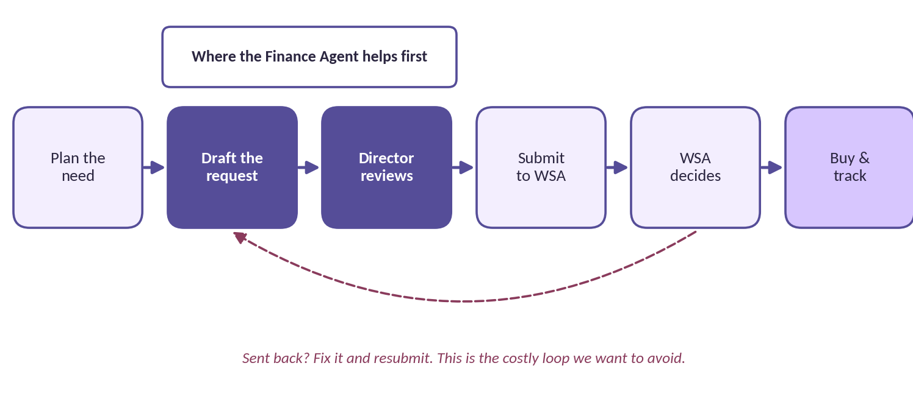
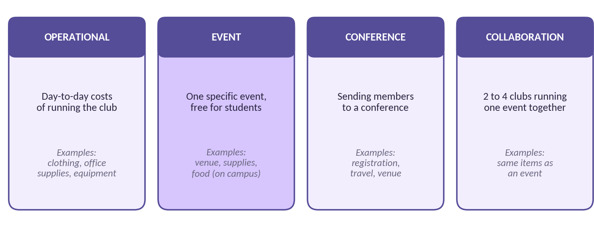
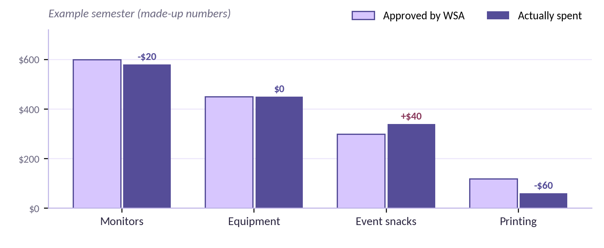
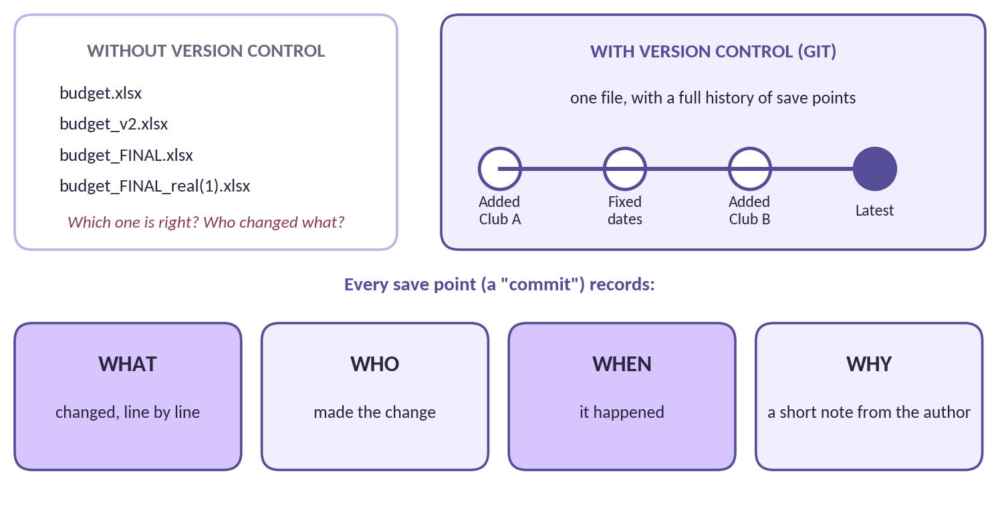
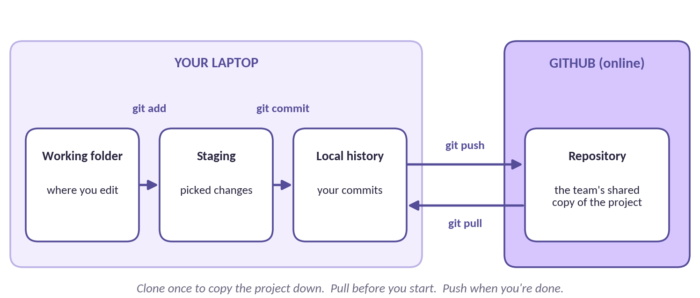
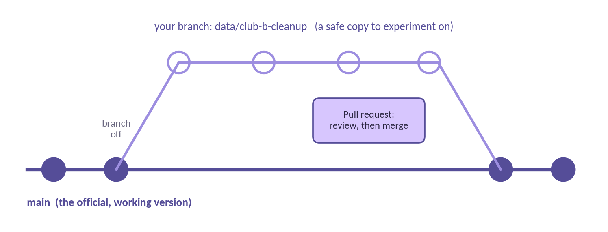
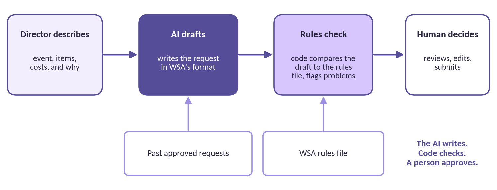
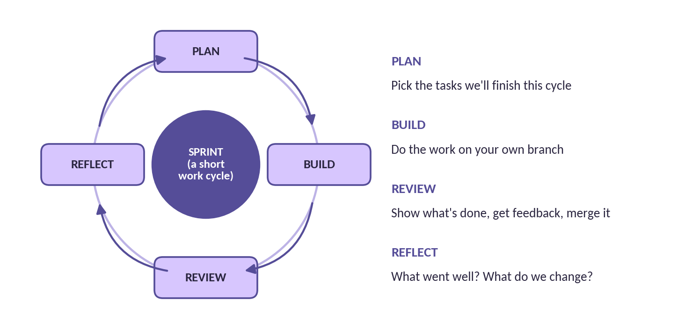
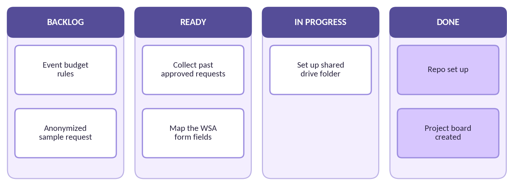
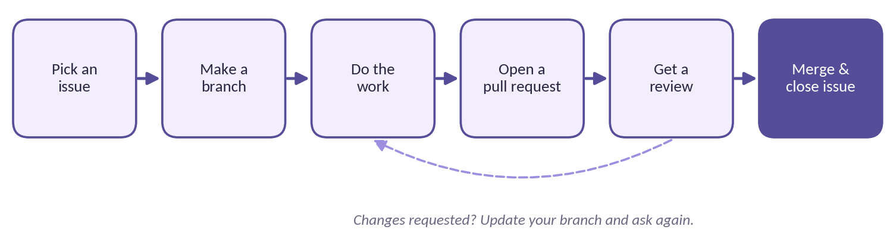

# DSAIC Finance Agent: Refresher Guide

**Document 2 of 3.** Finance, technical, and teamwork basics, explained from zero.

| | |
|---|---|
| **Read this if**      | You're joining the team. We assume you've never seen any of this before.            |
| **How to use it**     | Skim it once before kickoff. Come back to it whenever a word or step is unfamiliar. |
| **Project lead**      | Rafia Authoi                                                                        |
| **Version**           | 2.1 \| Draft                                                                        |
| **Related documents** | Document 1: Project Brief \| Document 3: Project Charter                            |

## How This Guide Is Organized

This project sits where three worlds meet: student government funding, technology, and teamwork. Most people are comfortable in one of them at most, and that's expected. This guide gives everyone the same starting point.

| **Part**                    | **Covers**                                                                  | **Why it matters**                                                    |
|-----------------------------|-----------------------------------------------------------------------------|-----------------------------------------------------------------------|
| **A. Finance & WSA Basics** | How WSA funding works, the four budget types, line items, and clean data    | You can't judge the agent's drafts if you don't know what WSA expects |
| **B. Technical Basics**     | Git and GitHub, your tools, data formats, how the AI works, and data safety | This is how we build together without breaking things                 |
| **C. Project Flow & Roles** | How we plan, track, and review work as a team                               | So everyone knows what to do next and how to get it done              |

> **You don't need to memorize this**
>
> Nobody expects you to know all of it by kickoff. Read it once so the words sound familiar, then use it as a reference. At the end of each part there's a short "You're ready if..." checklist.

**PART A**

## Finance & WSA Basics

### A1. How WSA funding works

Student organizations at WMU get most of their funding through the Western Student Association (WSA), our student government. A club plans what it needs, writes a budget request, and submits it to WSA. WSA reviews it against its rules and either approves it or sends it back for changes. Once funds are approved, the club buys what it asked for and keeps a record.



*Figure A1. The life of a WSA funding request*

**Where we come in:** the Finance Agent helps with the two dark steps, drafting the request and getting it ready for the finance director's review. Every time a request gets sent back, the club loses time. A complete, rule-checked draft is how we cut down on that loop.

### A2. The four budget types

WSA sorts funding requests into four types. Each has its own rules about what's allowed, how much, and what information is required. The exact rules live in the repository under docs/wsa-guidelines, in a reference checked against WSA's current bylaws (passed September 2026).



*Figure A2. WSA's four budget types*

### A3. Anatomy of a funding request

Every request is built from line items. A line item is one thing the club wants to buy, with a quantity, a cost, and a justification that explains why the club needs it. The justification is often what decides whether WSA approves an item, and it's the part finance directors spend the most time writing. Here is what line items look like (made-up example):

| **Item**        | **Qty** | **Unit cost** | **Total** | **Justification**                                                                |
|-----------------|---------|---------------|-----------|----------------------------------------------------------------------------------|
| 24-inch monitor | 2       | \$150.00      | \$300.00  | Second screens for workshop sessions where members follow along with a live demo |
| HDMI cables     | 4       | \$12.00       | \$48.00   | Connect members' laptops to shared displays during project nights                |
| Meeting snacks  | 1       | \$120.00      | \$120.00  | Snacks for four general meetings, averaging 30 attendees each                    |

The agent's job is to produce line items like these, in WSA's format, with justifications modeled on ones WSA has approved before. Every request must also include proof the club has sought outside funding, such as dues, fundraising, or sponsorship outreach. That became a WSA rule in September 2026.

### A4. Approved vs. actually spent

After funding is approved, what the club actually spends doesn't always match. Tracking the difference, called variance, is the second procedure we'll automate after funding requests. It helps clubs plan better next time and keeps records clean for the next finance director.



*Figure A3. Approved vs. spent (example numbers only)*

### A5. Why clean data matters

Computers are extremely literal. To a person, "Snacks", "food for mtg", and "Pizza" obviously mean the same thing. To a computer, they're three different categories. When we collect past requests, we'll standardize them so the agent can learn from them reliably:

| **Messy (what we have today)** | **Clean (what we're building)** |
|---|---|
| `9/5/24`<br>`Sept 5 2024`<br>`05-09-2024` | `2024-09-05`<br>One format: year-month-day. It sorts correctly and can't be misread. |
| `Snacks`<br>`food for mtg`<br>`Pizza` | `Food & refreshments`<br>One category name from an agreed list. |
| `$120`<br>`120 (approved)`<br>`120.00 USD` | `120.00`<br>Numbers only, in their own column. |
| `event`<br>`Event budget`<br>`EVT` | `event`<br>Budget type from exactly four options: operational, event, conference, collaboration. |

#### Our clean data rules

- One row per line item. No merged cells and no totals mixed in with data.

- Dates always written as YYYY-MM-DD.

- Every request tagged with exactly one budget type.

- Amounts as plain numbers. Approved and requested amounts in separate columns.

- If something is unknown, leave it blank and flag it. Never guess.

#### Words you'll hear

| **Term**          | **Plain meaning**                                                               |
|-------------------|---------------------------------------------------------------------------------|
| **Line item**     | One thing the club is asking to buy, with its quantity, cost, and justification |
| **Justification** | The explanation of why the club needs an item. Often what decides approval      |
| **Sent back**     | WSA returned a request for changes instead of approving it                      |
| **Variance**      | The difference between what was approved and what was actually spent            |
| **Fiscal year**   | The 12-month period a budget covers, usually the school year                    |

> **You're ready for Part A if you can...**
>
> - Walk through the life of a WSA funding request from plan to purchase.
>
> - Name the four budget types and give an example of each.
>
> - Explain what a line item and a justification are.
>
> - Spot three things wrong with a messy spreadsheet row.

**PART B**

## Technical Basics

### B1. What is version control?

Imagine five people editing the same spreadsheet by emailing copies back and forth. Within a week you'd have files named "budget_FINAL_real(1).xlsx" and nobody would know which one is correct. Version control solves this. It's a system that keeps one project with a complete history of every change: what changed, who changed it, when, and why.

Think of it like save points in a video game. Every time you reach a good spot, you save. If something goes wrong later, you can go back. The tool we use for version control is called Git.



*Figure B1. Life without and with version control*

#### Why we need it for this project

- **Several people, one project.** Up to five of us will edit data and code at the same time without overwriting each other.

- **Mistakes are reversible.** If a cleanup script breaks the data, we roll back to the last good version in seconds.

- **A built-in audit trail.** For financial data, being able to show exactly who changed what, and when, isn't optional. It's how people learn to trust the numbers.

- **It's an industry skill.** Almost every software team in the world uses Git. Learning it here is a real resume skill.

### B2. Git vs. GitHub

These two get mixed up constantly. Git is the program on your laptop that tracks changes. GitHub is a website that stores a shared copy of the project online so the whole team can access it. Git is like the save system; GitHub is like the cloud where everyone's saves meet.



*Figure B2. Your laptop and GitHub, and the commands that connect them*

| **Command**              | **What it does**                                       | **When you use it**                  |
|--------------------------|--------------------------------------------------------|--------------------------------------|
| `git clone <link>`       | Copies the project from GitHub to your laptop          | Once, on your first day              |
| `git pull`                 | Downloads the team's latest changes                    | Every time before you start working  |
| `git checkout -b <name>` | Creates your own branch (a safe copy) to work on       | When you start a new task            |
| `git add .`                | Picks which changes to include in your next save point | When you finish a piece of work      |
| `git commit -m "note"`     | Creates a save point with a short note explaining why  | Right after git add                  |
| `git push`                 | Uploads your save points to GitHub                     | When you're ready to share your work |

**Prefer clicking over typing?** VS Code has a Source Control panel that does all of this with buttons. You'll learn both at kickoff.

### B3. Branches and pull requests

The main branch is the official, working version of the project. Nobody edits it directly. Instead, you make a branch, which is your own copy to experiment on. When your work is ready, you open a pull request (PR), which asks the team, "Can I add my changes to main?" Someone reviews it, and once it's approved, it gets merged in.



*Figure B3. Branching off, working safely, and merging back through a pull request*

> **Branch naming**
>
> Name branches by type and task so everyone can tell what they're for: `data/club-b-cleanup`, `eval/food-questions`, `docs/setup-guide`, `feature/spending-tool`.

### B4. Your tools

| **Tool**     | **What it is**                                       | **What you'll use it for**                                       |
|--------------|------------------------------------------------------|------------------------------------------------------------------|
| **VS Code**  | A free code and file editor                          | Opening project files, editing data, running Git through buttons |
| **Terminal** | A window where you type commands instead of clicking | Running Git commands and scripts. VS Code has one built in.      |
| **GitHub**   | The website where our project lives                  | Pull requests, reviews, the task board, and Issues               |
| **Python**   | A beginner-friendly programming language             | Cleaning data and building the agent (builders only)             |

### B5. Data formats: CSV and JSON

**CSV** (comma-separated values) is a spreadsheet saved as plain text. Each line is a row, and commas separate the columns. You can open it in Excel or VS Code. Our anonymized sample requests will be stored this way.

```csv
budget_type,item,qty,unit_cost,justification
event,Meeting snacks,1,120.00,Snacks for four general meetings
```

**YAML and JSON** are ways of writing structured information with labels. The WSA rules live in a YAML file (wsa-club-finance-rules.yaml) that the agent's rules checker reads. You'll mostly read these, not write them.

```yaml
event:
  requires_justification: true
  allowed_categories: [food, venue, materials]
```

*That rules snippet is an illustration of the format only, not WSA's actual rules.*

### B6. How the AI fits in

A large language model (LLM) is an AI trained on huge amounts of text. It's very good at writing in a particular style, like the justifications on an approved WSA request. But it can also sound confident while being wrong, and it can miss a rule. For something that goes to student government, that's not acceptable on its own.

So the agent splits the work. The AI writes the draft, using past approved requests as examples. Separate code checks that draft against the WSA rules file and flags anything that looks off. Then a finance director reviews it and decides. Each part does what it's best at.



*Figure B4. How the Finance Agent produces a request*

> **The most important idea in this project**
>
> The AI writes. Code checks. A person approves. This is why Phase 1 matters so much: the agent can only be as good as the approved examples and the rules we give it.

#### What will power it?

We haven't picked the final tools yet, and that's on purpose. The plan is to collect the data first, decide exactly which tasks to automate, and then choose the tech stack that fits. One strong candidate is Hermes Agent, an open-source agent from Nous Research that can run on our own server and connect to tools like Slack or Discord. We'll test it with a short experiment before committing.

### B7. Keeping secrets and data safe

Our repository is public, so anyone on the internet can read it. That makes these rules non-negotiable:

- **Real funding requests never go on GitHub.** They live in the team's private shared drive. Only anonymized samples go in the repository.

- **Anonymize means all of it.** Replace names, emails, student IDs, account numbers, and signatures with fake values. Keep the items, costs, and justifications realistic.

- **Passwords and keys live in a** .env **file** that Git is set to ignore.

- **One club's data never shows up in another club's drafts.** Each organization gets its own separate setup.

- **If you think something was shared by mistake,** tell the project lead right away. Fixing it fast matters more than whose fault it was.

#### Where this is heading: containers and the AI server

During development, the agent runs on our laptops using sample data. Later, it moves into a container (a sealed package that runs the same way on any computer) on DSAIC's AI Inference Server, so real financial data stays on hardware the club controls. You don't need to learn containers now.

> **You're ready for Part B if you can...**
>
> - Explain version control to a friend using the "save points" idea.
>
> - Say the difference between Git and GitHub.
>
> - Describe what a branch and a pull request are for.
>
> - Explain why the AI's draft gets checked by code and approved by a person.
>
> - Name two things that should never be uploaded to our public repository.

**PART C**

## Project Flow & Role Basics

### C1. How we work: Agile and sprints

We'll use Agile, a common way of running projects in tech. Instead of planning everything up front and building it all at once, Agile teams work in short cycles called sprints. Each sprint, we pick a small set of tasks, finish them, show the results, and adjust. It means we find problems early and always have something working.



*Figure C1. The sprint cycle (sprint length TBD)*

### C2. The project board

All work lives on a project board (a Kanban board) in GitHub. Every task is a card, also called an Issue. Cards move left to right as work progresses. At any moment, anyone can look at the board and see what's happening, who's on it, and what's stuck.



*Figure C2. Example project board*

- If you're working on something, its card should be in In Progress with your name on it.

- If you're stuck for more than a day, comment on the card and tag the project lead.

- Cards labeled "good first issue" are designed for people new to the project.

### C3. How a change gets into the project

Every change, whether it's cleaned data, new code, or a documentation update, follows the same path:



*Figure C3. The contribution workflow*

#### Before you open a pull request, check that:

|     | **Pull request checklist**                                                        |
|-----|-----------------------------------------------------------------------------------|
| ☐   | The title says what changed in plain words ("Standardize Club B 2024 categories") |
| ☐   | The description links the Issue it closes and explains what you did and why       |
| ☐   | No real financial data, passwords, or keys are included                           |
| ☐   | You pulled the latest main branch first, so there are no conflicts                |
| ☐   | You tested or double-checked your work (for data: spot-check a few rows by hand)  |

### C4. Roles at a glance

Each team member has a primary role. Full responsibilities and deliverables are in Document 3, the Project Charter.

| **Role**               | **In one line**                                                       | **Good fit if you...**                               |
|------------------------|-----------------------------------------------------------------------|------------------------------------------------------|
| **Project Lead**       | Plans the work, unblocks the team, makes final calls                  | (Rafia Authoi)                                       |
| **Data Steward**       | Collects and anonymizes past approved requests                        | Like spreadsheets, organizing, and details           |
| **Rules & QA Analyst** | Documents WSA rules and checks whether the agent's drafts follow them | Like reading rules closely and asking "are we sure?" |
| **Agent Developer**    | Builds the drafting agent and the rules checker                       | Want to code, or want to learn                       |
| **Docs & Comms Lead**  | Keeps guides, meeting notes, and the project board up to date         | Like writing, organizing, and keeping people in sync |

### C5. Meetings and communication

| **Meeting**                    | **Purpose**                                           | **When / where**                           |
|--------------------------------|-------------------------------------------------------|--------------------------------------------|
| **Kickoff**                    | Meet the team, set up laptops, assign roles           | First Friday meeting                       |
| **Weekly team meeting**        | Updates, pick tasks from Ready, work through blockers | Fridays, 6:30 PM, Student Center or online |
| **Sprint review & reflection** | Demo what's done; discuss what to improve             | End of each sprint (length TBD)            |

Day-to-day questions go in the team's Microsoft Teams channel. To be added, email the project lead, Rafia Authoi, at rafiahasan.authoi@wmich.edu. Task-specific discussion goes on the Issue or pull request itself, so the history stays with the work.

> **You're ready for Part C if you can...**
>
> - Explain what a sprint is and what happens in each step.
>
> - Find the project board and describe what each column means.
>
> - Walk through the six steps of getting a change into the project.
>
> - Name the role you're most interested in and why.

> **Stuck on anything here?**
>
> That's what the team is for. Ask in the team channel or contact Rafia Authoi at [rafiahasan.authoi@wmich.edu](mailto:rafiahasan.authoi@wmich.edu).

---

**Project documents:** [1. Project Brief](01-project-brief.md) | [2. Refresher Guide](02-refresher-guide.md) | [3. Project Charter](03-project-charter.md)

Word versions of these documents are kept in the team's shared drive. Questions? Email the project lead, Rafia Authoi, at rafiahasan.authoi@wmich.edu.
