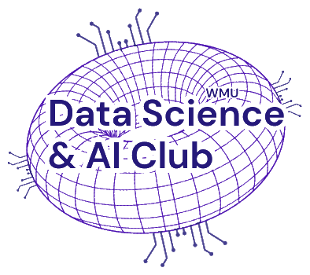
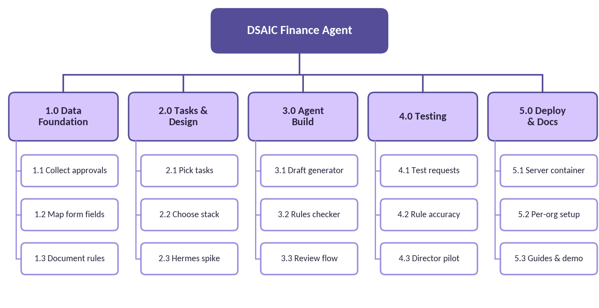
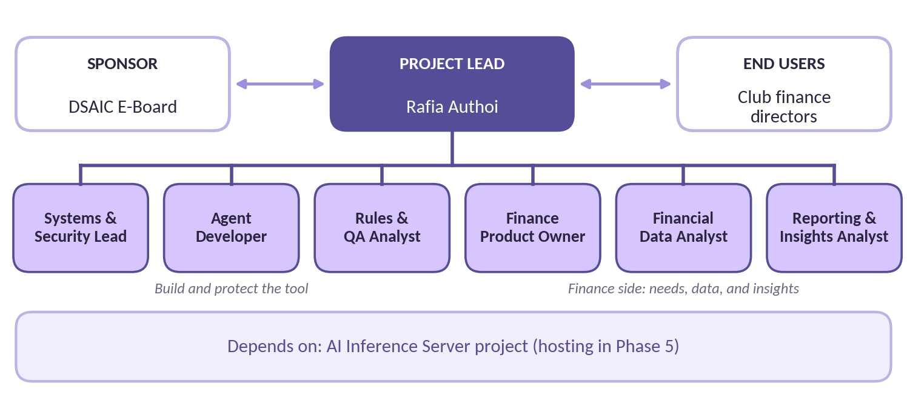
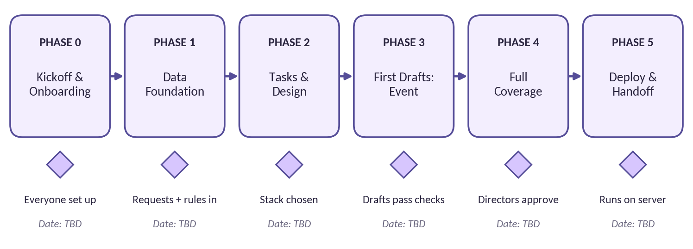
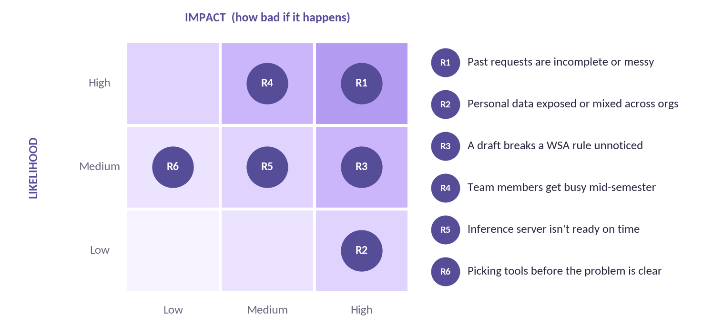

# DSAIC Finance Agent: Project Charter

**Document 3 of 3.** Roles, expectations, deliverables, and how we'll run the project.

| | |
|---|---|
| **Project**          | DSAIC Finance Agent                                                                     |
| **Project lead**     | Rafia Authoi                                                                            |
| **Sponsor**          | Data Science & AI Club (DSAIC) E-Board                                                  |
| **Team size**        | 7 members, including the project lead                                                   |
| **Methodology**      | Agile hybrid: phases with milestone gates, 2-week sprints, and a Kanban board on GitHub |
| **Version / status** | 2.2 \| Roles confirmed October 2, 2026                                                  |

## 1. Project Overview

### 1.1 Purpose

Student organizations at WMU request funding from the Western Student Association (WSA) through budget requests that must follow WSA's rules, with separate criteria for operational, event, conference, and collaboration budgets. Finance directors build these requests by hand, one at a time, and the knowledge of what gets approved is lost every year. This project builds an AI agent that drafts WSA funding requests from previously approved examples, checks them against WSA's rules, and hands them to a finance director for review before submission.

### 1.2 Vision statement

> *Any club finance director can describe what their organization needs and receive a complete, rule-checked WSA funding request ready for their review, built on what WSA has approved before, with their data kept private to their organization.*

### 1.3 Project details

|                             |                                                                                                  |
|-----------------------------|--------------------------------------------------------------------------------------------------|
| **Start date**              | TBD (see project board)                                                                          |
| **Target completion**       | TBD (see project board)                                                                          |
| **First procedure**         | WSA funding requests: operational, event, conference, and collaboration budgets                  |
| **Next procedure**          | Purchase tracking: recording what each organization bought with approved funds                   |
| **Development environment** | Team members' laptops, using anonymized sample data only                                         |
| **Production environment**  | Container on DSAIC's AI Inference Server                                                         |
| **Key dependency**          | AI Inference Server project (needed for Phase 5)                                                 |
| **Repository**              | [github.com/rafiaauthoi/dsaic-finance-agent](https://github.com/rafiaauthoi/dsaic-finance-agent) |
| **Project board**           | [DSAIC Finance Agent board](https://github.com/users/rafiaauthoi/projects/1)                     |
| **Meetings**                | Fridays, 6:30 PM, at the Student Center or online                                                |

## 2. Objectives and Success Measures

Each objective has a way to measure it, so we can tell when we're actually done. Target values will be confirmed with the team once Phase 1 shows us what the data looks like.

| **ID** | **Objective**                                               | **How we'll measure it**                                           | **Target**  |
|--------|-------------------------------------------------------------|--------------------------------------------------------------------|-------------|
| **O1** | Build a library of past approved WSA requests               | Approved requests collected, anonymized, and tagged by budget type | TBD         |
| **O2** | Document WSA's rules in a form both people and code can use | Rules written up for all four budget types, with sources           | All 4 types |
| **O3** | Generate complete draft requests                            | Share of drafts a finance director accepts with only minor edits   | TBD         |
| **O4** | Catch rule problems before submission                       | Share of known rule violations the checker flags on a test set     | TBD         |
| **O5** | Save finance directors real time                            | Time to prepare a request, before vs. after, reported by directors | TBD         |
| **O6** | Run privately for multiple organizations                    | Agent runs on the club server, each org's data kept separate       | Deployed    |

## 3. Scope

Defining scope protects the team from scope creep, which is when a project keeps growing until nothing gets finished. If an idea isn't in scope, it goes on a "future ideas" list instead of into the current work.

| **In scope**                                                                                                 | **Out of scope (for now)**                                   |
|--------------------------------------------------------------------------------------------------------------|--------------------------------------------------------------|
| Collecting and anonymizing past approved WSA requests                                                        | Submitting requests to WSA on anyone's behalf                |
| Documenting WSA rules for operational, event, conference, and collaboration budgets                          | Guaranteeing WSA approval                                    |
| Drafting WSA funding requests from a director's description, including the required proof of outside funding | Funding sources other than WSA                               |
| Automatically checking drafts against WSA rules                                                              | Moving money, making purchases, or approving expenses        |
| A review step where a finance director edits and approves                                                    | Replacing official WSA or university records                 |
| Per-organization setup with data kept separate                                                               | Purchase tracking (planned as the next procedure)            |
| Deployment to DSAIC's AI Inference Server                                                                    | Building or maintaining the server itself (separate project) |

## 4. Work Breakdown Structure

A Work Breakdown Structure (WBS) splits the project into smaller, manageable pieces. Each numbered box becomes one or more issues on the project board. The order follows the plan agreed with the club president: collect the data, identify the tasks to automate, then choose the tech stack and design from what we learn.

*Figure 1. Work Breakdown Structure*

## 5. Team and Roles

The team has seven members. Each person has one primary role, but everyone helps where needed. Roles were confirmed at the October 2, 2026 team meeting. Three roles build and protect the tool, three represent the finance side (what directors need, the data, and what it shows), and the project lead connects them.

*Figure 2. Project team structure*

### 5.1 Role descriptions

#### Project Lead

|   |   |
|---|---|
| **Assigned to** | Rafia Authoi |
| **Responsibilities** | Sets priorities, runs sprint planning, and writes each week's agenda and meeting notes Keeps the project board current, unblocks teammates, and makes final decisions on scope and design Reviews and approves pull requests; keeps the README and guides accurate Coordinates with the DSAIC E-Board, WSA contacts, and the AI Inference Server team |
| **Deliverables** | Project board and sprint plans Weekly agendas and meeting notes Tech stack decision record (Phase 2) README, guides, and status updates to the E-Board |

#### Systems & Security Lead

|   |   |
|---|---|
| **Assigned to** | Saad Mahmud |
| **Responsibilities** | Controls who can see real funding documents in the private shared drive Reviews repository security: branch rules, code owners, and secret scanning Gives the second-person check on every anonymized sample before it is merged Plans a secure, per-organization setup for deployment to the AI server |
| **Deliverables** | Access review of the shared drive and repository Sign-off on every anonymized sample Security and deployment checklist (Phase 5) |

#### Agent Developer

|   |   |
|---|---|
| **Assigned to** | Justin Tan |
| **Responsibilities** | Builds the rules checker that reads the rules file and flags problems Builds the drafting agent that turns a director's description into a request Runs the Hermes Agent experiment with the project lead and compares options in Phase 2 Works with the project lead and the Systems & Security Lead to containerize and deploy |
| **Deliverables** | Rules checker with tests Tech stack experiment write-up Working draft generator Deployment container and setup notes |

#### Rules & QA Analyst

|   |   |
|---|---|
| **Assigned to** | Matt Phinney |
| **Responsibilities** | Keeps the WSA rules docs current, with sources, when WSA changes a rule Builds a test set: sample requests with known rule problems the checker should catch Reviews the agent's drafts and records what it gets right and wrong Gathers feedback from finance directors during the pilot |
| **Deliverables** | Test set of requests with known issues Draft quality reports each sprint Pilot feedback summary |

#### Finance Product Owner

|   |   |
|---|---|
| **Assigned to** | Syed Sobhan |
| **Responsibilities** | Represents club finance chairs: what they need and what matters most Sets priorities with the project lead during sprint planning Supplies past approved requests and funding letters, and records WSA deadlines Reviews drafts and says whether a finance chair could use them as-is |
| **Deliverables** | Prioritized list of what finance chairs need Fall 2026 WSAAC deliberation calendar Draft reviews each sprint once drafts exist |

#### Financial Data Analyst

|   |   |
|---|---|
| **Assigned to** | Drew Lindeboom |
| **Responsibilities** | Collects past approved WSA requests and tracks what's missing Records each request and line item in the tracking sheet, including what was cut and why Standardizes line items, categories, dates, and amounts Anonymizes samples using the anonymization checklist and maps every field on the WSA form |
| **Deliverables** | Tracking sheet of past requests Anonymized sample requests for each budget type Form field map (docs/wsa-guidelines/form-fields.md) |

#### Reporting & Insights Analyst

|   |   |
|---|---|
| **Assigned to** | Sami Sarker |
| **Responsibilities** | Turns the tracking sheet into charts that show what WSA funds Tracks approval rates, amounts by budget type, and the most common reasons items get cut Works from the anonymized copy of the tracking sheet Prepares charts for sprint reviews and the end-of-year showcase |
| **Deliverables** | Funding insights dashboard Charts for sprint reviews and the showcase |

### 5.2 Responsibility matrix (RACI)

A RACI matrix shows who does what. For each task: R is Responsible (does the work), A is Accountable (owns the outcome and signs off), C is Consulted (gives input), and I is Informed (kept updated).

| **Task**                                   | **Lead** | **Security** | **Dev** | **Rules/QA** | **Product** | **Data** | **Insights** |
|--------------------------------------------|----------|--------------|---------|--------------|-------------|----------|--------------|
| **Set up shared drive for real documents** | R/A      | C            | I       | I            | I           | I        | I            |
| **Control data access and repo security**  | A        | R            | C       | I            | I           | I        | I            |
| **Collect and anonymize past requests**    | A        | C            | I       | C            | C           | R        | I            |
| **Map WSA form fields**                    | A        | I            | C       | C            | C           | R        | I            |
| **Document WSA rules**                     | A        | I            | C       | R            | C           | C        | I            |
| **Set priorities and plan sprints**        | R/A      | C            | C       | C            | R           | C        | C            |
| **Choose tasks and tech stack**            | R/A      | C            | R       | C            | C           | I        | I            |
| **Hermes Agent experiment**                | A        | I            | R       | C            | I           | I        | I            |
| **Build draft generator**                  | A        | I            | R       | C            | C           | C        | I            |
| **Build rules checker**                    | A        | I            | R       | C            | I           | I        | I            |
| **Test drafts and run director pilot**     | A        | I            | C       | R            | R           | C        | I            |
| **Funding insights dashboard**             | A        | I            | I       | I            | C           | C        | R            |
| **Deploy to AI server**                    | A        | C            | R       | C            | I           | I        | I            |
| **README, guides, and showcase**           | R/A      | I            | C       | C            | C           | I        | C            |

## 6. Deliverables

**Deadlines:** all due dates are TBD and will be set during sprint planning. Always check the project board for current deadlines.

| **ID**  | **Deliverable**                 | **Owner**                     | **Phase** | **Done when...**                                                    | **Due** |
|---------|---------------------------------|-------------------------------|-----------|---------------------------------------------------------------------|---------|
| **D1**  | Team setup complete             | All                           | 0         | Everyone can clone the repo and open a pull request                 | TBD     |
| **D2**  | Shared drive for real documents | Project Lead                  | 1         | Private folder exists, access limited to the team                   | TBD     |
| **D3**  | Past request library            | Data Analyst                  | 1         | Approved requests collected and tracked by budget type              | TBD     |
| **D4**  | Form field map                  | Data Analyst                  | 1         | Every WSA form field documented                                     | TBD     |
| **D5**  | WSA rules docs                  | Rules & QA                    | 1         | Rules for all four budget types written up with sources             | TBD     |
| **D6**  | Anonymized samples              | Data Analyst & Security       | 1         | At least one per budget type, checked by the Security Lead          | TBD     |
| **D7**  | Tech stack decision             | Lead & Dev                    | 2         | Options tested, choice and reasons written in the repo              | TBD     |
| **D8**  | Event request drafts            | Agent Developer               | 3         | Agent drafts event requests that pass the rules checker             | TBD     |
| **D9**  | All budget types + pilot        | Dev, Rules/QA & Product Owner | 4         | Finance directors approve drafts with minor edits                   | TBD     |
| **D10** | Deployed agent                  | Dev & Security                | 5         | Runs on the AI server, data separated by organization               | TBD     |
| **D11** | Documentation & showcase        | Project Lead                  | 5         | A new member can set up the project from the docs alone             | TBD     |
| **D12** | Security review                 | Systems & Security            | 0         | Drive access and repository settings reviewed and fixed             | TBD     |
| **D13** | Funding insights dashboard      | Reporting & Insights          | 1-2       | Shows approval rates and common cut reasons from the tracking sheet | TBD     |

## 7. Phases and Milestones

The project runs in six phases. Each phase ends at a milestone gate: a clear check that must be met before moving on. Within each phase, work happens in sprints. Purchase tracking begins after Phase 5 as the next procedure.

*Figure 3. Project phases and milestone gates (dates TBD)*

| **Phase**                   | **Focus**                                                                        | **Milestone gate (exit criteria)**                             | **Target date** |
|-----------------------------|----------------------------------------------------------------------------------|----------------------------------------------------------------|-----------------|
| **0. Kickoff & Onboarding** | Roles, laptop setup, first practice pull request                                 | Every member has merged one practice PR                        | TBD             |
| **1. Data Foundation**      | Collect past approved requests, map the form, document the rules                 | Request library, form map, and rules docs approved by the lead | TBD             |
| **2. Tasks & Design**       | Decide exactly what to automate; test Hermes Agent and alternatives              | Tech stack chosen and written up, with evidence                | TBD             |
| **3. First Drafts: Event**  | Draft generator and rules checker for event budgets                              | Event drafts pass the rules checker on the test set            | TBD             |
| **4. Full Coverage**        | Operational, conference, and collaboration budgets; pilot with finance directors | Directors approve drafts with only minor edits                 | TBD             |
| **5. Deploy & Handoff**     | Move to the AI server, per-org setup, finish docs                                | Runs on the server; docs verified by a new member              | TBD             |

### 7.1 How we work

We combine three common approaches. Each one solves a different problem for a student team with changing schedules.

- **Phases with milestone gates.** The six phases above set the big picture. A phase doesn't start until the one before it meets its gate, so we never pick tools before we understand the problem.

- **Two-week sprints.** Inside each phase, work happens in two-week sprints that start at a Friday meeting. Short sprints keep tasks small enough to finish around exams and busy weeks. The length can change if the team finds it isn't working.

- **A Kanban board.** Day to day, every task is a card on the GitHub project board that moves from Backlog to Ready to In Progress to In Review to Done. Anyone can see where things stand without asking.

#### The sprint cycle

- **Sprint planning (first Friday of a sprint).** The Project Lead and the Finance Product Owner decide what goes into the sprint, based on what finance chairs need most. Each person then picks their cards from the Ready column.

- **Weekly check-in (every Friday).** A quick round: what you finished, what you're working on next, and anything blocking you.

- **Sprint review and reflection (last Friday of a sprint).** We show what got done, then talk about what went well and what to change for the next sprint.

- **Done means done.** A card only moves to Done when it meets the Definition of Done in section 8.3.

Sprint 1 runs October 2 to October 15, 2026. Current sprint dates are always on the project board.

## 8. Team Expectations

These are our working agreements. They exist so everyone knows what they can count on from each other.

### 8.1 Working agreements

- **Show up or give notice.** Attend the Friday meetings. If you can't make one, post your update in the team channel beforehand.

- **Keep the board honest.** If you're working on a task, its card shows it. If you're blocked, say so on the card.

- **Ask early.** Stuck for more than a day? Ask for help. Asking early is a strength, not a weakness.

- **Say it when you're overloaded.** Exams and busy weeks happen. Tell the lead as early as you can so work can be shifted.

- **Everything goes through a pull request.** No one pushes directly to main, including the project lead.

- **Problem before tools.** New tools are exciting, but every technical choice has to trace back to a real task from Phase 1 and 2.

- **Review kindly, receive openly.** Comment on the work, not the person. Assume good intent.

### 8.2 Privacy and confidentiality

> **Non-negotiable**
>
> - The repository is public. Real funding requests never go on GitHub, in group chats, or on personal cloud drives. They stay in the team's private shared drive.
>
> - Only anonymized samples go in the repository, and a second teammate checks each one before it's merged.
>
> - One organization's data is never used in, or visible from, another organization's drafts.
>
> - Passwords and API keys stay in .env files and are never committed.
>
> - Internal planning documents (like statements of work) stay within the team until finalized.
>
> - If you think data was exposed, tell the project lead immediately.

### 8.3 Definition of Done

A task is only "done" when all of the following are true:

|     | **Definition of Done**                                                  |
|-----|-------------------------------------------------------------------------|
| ☐   | The work is merged into main through an approved pull request           |
| ☐   | It was reviewed by at least one other team member                       |
| ☐   | It contains no real funding documents, personal information, or secrets |
| ☐   | Any related documentation (README, rules docs, form map) is updated     |
| ☐   | The issue is closed and the card is in the Done column                  |

## 9. Risk Management

A risk is something that could go wrong. Listing risks early means we can plan for them instead of being surprised. The heat map shows how likely each risk is and how much damage it would do; risks in the darker upper-right cells get the most attention.

*Figure 4. Risk heat map*

| **ID** | **Risk**                                   | **Likelihood** | **Impact** | **Response plan**                                                                                | **Owner**       |
|--------|--------------------------------------------|----------------|------------|--------------------------------------------------------------------------------------------------|-----------------|
| **R1** | Past requests are incomplete or messy      | High           | High       | Track what's missing instead of guessing; start with the budget type that has the most examples  | Data Analyst    |
| **R2** | Personal data exposed or mixed across orgs | Low            | High       | Real data only in the private drive; second-person check on every sample; separate setup per org | Security Lead   |
| **R3** | A draft breaks a WSA rule unnoticed        | Medium         | High       | Rules enforced by code, not just the AI; test set with known problems; director always reviews   | Rules & QA      |
| **R4** | Team members get busy mid-semester         | High           | Medium     | Small tasks; early heads-up rule; documented work so others can pick it up                       | Project Lead    |
| **R5** | AI Inference Server isn't ready on time    | Medium         | Medium     | Keep the laptop version working; coordinate with the server team                                 | Project Lead    |
| **R6** | Picking tools before the problem is clear  | Medium         | Low        | Time-boxed Hermes experiment in Phase 2; stack decision written up with evidence                 | Agent Developer |

## 10. Communication Plan

| **What**                          | **Who**                                             | **How often**                              | **Where**                                                    |
|-----------------------------------|-----------------------------------------------------|--------------------------------------------|--------------------------------------------------------------|
| **Team meeting**                  | Whole team                                          | Weekly, Fridays at 6:30 PM                 | Student Center or online                                     |
| **Sprint planning**               | Project Lead and Product Owner, with the team       | First Friday of each sprint                | Friday meeting                                               |
| **Sprint review & reflection**    | Whole team                                          | Last Friday of each sprint                 | Friday meeting                                               |
| **Agenda and meeting notes**      | Project Lead                                        | Every meeting (agenda before, notes after) | Microsoft Teams channel                                      |
| **Quick questions and updates**   | Whole team                                          | Anytime                                    | Microsoft Teams channel (email the project lead to be added) |
| **Task discussion**               | Task owner and reviewers                            | As needed                                  | On the GitHub issue or pull request                          |
| **Status update to sponsor**      | Project Lead to E-Board                             | TBD                                        | E-Board meetings                                             |
| **Recruiting and showcase posts** | Project Lead, with charts from Reporting & Insights | At milestones                              | DSAIC LinkedIn and Instagram                                 |

## 11. Assumptions and Constraints

#### Assumptions

- Past approved WSA requests in the shared drive can be used by the team to build and test the agent.

- WSA's rules for each budget type are available in written form and change rarely during a semester.

- The AI Inference Server will be available to host the agent by Phase 5.

- Team members have a laptop that can run VS Code, Git, and Python.

#### Constraints

- Team members are students with changing schedules; timelines must allow for exams and breaks.

- The repository is public, so real financial data must stay out of it at every stage.

- The project uses free and open-source tools and existing club hardware.

## 12. Approval

By signing, team members confirm they've read this charter and agree to its working agreements and privacy rules.

| **Name**       | **Role**                     | **Signature** | **Date** |
|----------------|------------------------------|---------------|----------|
| Rafia Authoi   | Project Lead                 |               |          |
| Saad Mahmud    | Systems & Security Lead      |               |          |
| Justin Tan     | Agent Developer              |               |          |
| Matt Phinney   | Rules & QA Analyst           |               |          |
| Syed Sobhan    | Finance Product Owner        |               |          |
| Drew Lindeboom | Financial Data Analyst       |               |          |
| Sami Sarker    | Reporting & Insights Analyst |               |          |
|                | Sponsor (DSAIC E-Board)      |               |          |

---

**Project documents:** [1. Project Brief](01-project-brief.md) | [2. Refresher Guide](02-refresher-guide.md) | [3. Project Charter](03-project-charter.md)

Word versions of these documents are kept in the team's shared drive. Questions? Email the project lead, Rafia Authoi, at rafiahasan.authoi@wmich.edu.
